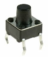

# EventButton

> **The new version of EventButton can now be found in the [InputEvents library]().**

A comprehensive event library for efficient, maintainable working with buttons. 

* Press and release events
* Multi-click events (single, double, triple - however many you want)
* Optional long press repeat
* Many other events are fired (see below)
* An ID and state can be held and the button can be disabled at runtime to temporarily prevent events firing

It is effectively an event wrapper for Thomas Fredericks' [Bounce2 library](https://github.com/thomasfredericks/Bounce2) and inspired by Lennart Hennigs [Button2 library](https://github.com/LennartHennigs/Button2)

Huge thanks to the above - I am standing on the shoulders of giants.




## INSTALLATION & DOWNLOAD
Install via the Arduino Library Manager or download from [github](https://github.com/Stutchbury/EventButton).

## BASIC USAGE

### INSTANTIATE

```cpp
#include <EventButton.h>
EventButton eb1(<SWITCH_PIN>);

// Create one or more callback functions 
void onEb1Clicked(EventButton& eb) {
  Serial.print("eb1 clicked. Click count: ");
  Serial.println(eb.clickCount());
}
```

### SETUP

```cpp
// Link event to function defined above
eb1.setClickHandler(onEb1Clicked);
```
### LOOP

```cpp
// Call 'update' for every EventButton
eb1.update();
```

## Constructors

Construct a button
```cpp
EventButton(byte switchPin);
```

## Loop method

There is only one method to be called from loop but it must be called for each defined ```EventButton```.  

**```void update()```** reads and updates the state of the button. This will fire the appropriate handlers.

## Setup methods

Normally called from within ```setup()``` but can be updated at runtime.

### Setting button callback handlers

Each of these methods (optionally) sets the function to be called on the event being fired. 

They all take a single argument of your function name (except ```setLongPressHandler``` which takes and optional ```bool``` to repeatedly fire or not).

For an ESP8288/32 or Teensy you can also pass a class method - see ```ClassMethodLambdaCallback.ino``` in the examples.

**```setChangedHandler```** fires when button state changes:  
Rarely used - try 'pressed', 'released' or 'clicked' first.

**```setPressedHandler```** fires after button is pressed down:

**```setReleasedHandler```** fires after button is released:  

**```setClickHandler```** fires after button is clicked (when pressed duration is less than setLongClickDuration() (default 750ms)   
Note: the number of multi clicks can be read from EventButton.clickCount() in the callback so you are not limited to double or triple clicks - any number can be actioned.   
If double or triple click callbacks are set, this will not be fired for those events.

**```setDoubleClickHandler```** fires after button is double clicked  
Determined by ```setMultiClickInterval()``` (default 250ms)   
Syntactic sugar for click handler + clickCount == 2
    
**```setTripleClickHandler```** fires when button is triple clicked  
Syntactic sugar for click handler + clickCount == 3

**```setLongClickHandler```** fires *after* button is long clicked (ie when pressed duration is greater than ```setLongClickDuration(ms)``` (default 750ms)   
See also long press handler

**```setLongPressHandler```** fired *while* button is long pressed.   
By default, this fires once but can fire every ```setLongClickDuration()``` by passing 'true' as a second argument to ```setLongPressHandler()``` or by setting ```setLongPressRepeat()``` to true.   
Use ```longPressCount()``` in the callback to read the number of times this event has fired for the current 'press'.  
This event, combined with released event can be very useful for triggering actions based on duration of press. As a general rule (more of a guidline, really), use the repeated long press event to update the UI and the 'released' event to take action. The ```longPressCount``` is available in the released callback too.
    
**```setIdleHandler```** fires after the button has been idle for ```setIdleTimeout(ms)``` (default 10 seconds).

### Button settings    

**```setDebounceInterval(unsigned int intervalMs)```** - default is set in the Bounce2 library (currently 10ms)

**```setMultiClickInterval(unsigned int intervalMs)```** - set the interval (in ms) between double, triple or multi clicks.

**```setLongClickDuration(unsigned int longDurationMs)```**  - set the ms that defines a long click.   
Long pressed callback will be fired at this interval if repeat is set to true via the ```setLongPressHandler()``` second argument or ```setLongPressRepeat()```.

**```setLongPressRepeat(bool repeat=false)```** - choose whether to repeat the long press callback (default is 'false').

### Setting idle timeout 

**```setIdleTimeout(unsigned int timeoutMs)```** Set the idle timeout in ms (default 10000)

### Setting id or user state 


**```setUserId(unsigned int identifier)```** Set a user defined value to identify this button. Not used by the library and does not have to be unique (defaults to 0). Useful when multiple buttons call the same handler.  
Note: this is 'user' as in 'user of the library'. 


**```setUserState(unsigned int state)```** Set a user defined state for this button. Eg enum for ON, OFF, INACTIVE etc. Not used by the library.

### Read button state

From within your callback function.

**```buttonState()```** Directly get the current button state from Bounce2.  
Note: this will read LOW when pressed.

**```unsigned long currentDuration()```** Directly get the duration of the button current state from Bounce2.

**```unsigned long previousDuration()```** Directly get the duration of the button previous state from Bounce2.

**```unsigned char clickCount()```** The number of multi-clicks that have been fired in the clicked event.
    
**```uint8_t longPressCount()```** The number of times the long press handler has  been fired in the button pressed event. Also available in the released callback.

### Timeout
**```unsigned long msSinceLastEvent()```** Returns the number of ms since any event was fired for this button.

### Getting user id or user state 

**```unsigned int userId()```** Return the user defined value that identifies this button. May not be unique.

**```unsigned int userState()```** Returns the user defined state for this button.

### Enabling/disabling the EventButton

**```void enable(bool=true)```** Disabling the EventButton will prevent all events firing. Pass ```true``` to enable (default) or ```false``` to disable.

**```bool enabled()```** Returns ```true``` if enabled or ```false``` if disabled.